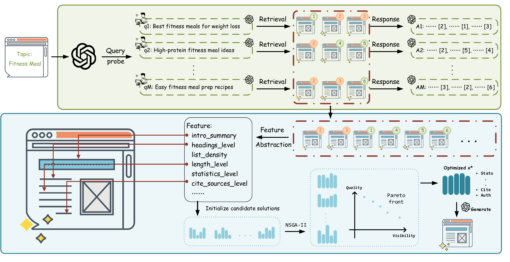

# FeatGEO: Feature-space Optimization for Generative Engine Optimization

<p>
  
  <a href="https://arxiv.org/abs/2604.19113"></a>
</p>

This paper has been accepted to ACL 2026.

## TLDR

**FeatGEO** optimizes generated advertisement webpages in an interpretable feature space to improve citation visibility in generative search while maintaining content quality.

## Abstract

> Generative answer engines expose content through selective citation rather than ranked retrieval, fundamentally altering how visibility is determined. Existing generative engine optimization approaches primarily rely on token-level text rewriting, offering limited interpretability and weak control over the trade-off between citation visibility and content quality.
>
> FeatGEO is a feature-level, multi-objective optimization framework that abstracts webpages into interpretable structural, content, and linguistic properties. Instead of directly editing text, FeatGEO optimizes over this feature space and uses a language model to realize feature configurations into natural language, decoupling high-level optimization from surface-level generation.
>


<p align="center">
  
</p>
<p align="center"><sub>Overview of the FeatGEO pipeline.</sub></p>

## Installation

```bash
conda create -n geo python=3.9
conda activate geo

pip install -r requirements.txt
```


## Quick Start

Run a single worker:

```bash
python -m featgeo.geo_ad.run_geo_ad
```

Run parallel shards:

```bash
python -m featgeo.geo_ad.run_parallel
```

Merge shard outputs:

```bash
python -m featgeo.geo_ad.merge_results
```

## Key Settings

| Setting | Description |
| --- | --- |
| `OPENAI_API_KEYS` | OpenAI-compatible API keys. Parallel shards receive keys in order. |
| `OPENAI_API_BASE` | Official OpenAI endpoint or compatible relay endpoint. |
| `SAMPLING_MODE` | `continuous`,  `random`, `all`. |
| `RANDOM_SAMPLE_SIZE` | Number of samples used when `SAMPLING_MODE = "random"`. |
| `PARALLEL_SHARDS` | Number of workers used by `run_parallel.py`. |


## Outputs

| Path | Description |
| --- | --- |
| `featgeo/data/query_results_*.json` | Per-query experiment results. |
| `featgeo/data/ad_ga_evaluation_cache_*.json` | Cached candidate evaluations. |
| `featgeo/geo_ad/logs/*.log` | Worker and shard logs. |
| `result/merge_report_*.txt` | Text-format merged report. |
| `result/summary_*.json` | Machine-readable merged summary. |

## Repository Structure

```text
featgeo/
|-- config.py
|-- generative_le.py
|-- geo_functions.py
|-- utils.py
`-- geo_ad/
    |-- run_geo_ad.py            # runs the experiment on one data slice
    |-- run_parallel.py          # launches parallel experiment slices
    |-- merge_results.py         # combines slice outputs into final reports
    |-- feature_schema.py        # defines the optimization feature space
    |-- feature_extractor.py     # maps source pages into feature configs
    |-- ga_optimizer.py          # searches feature configs with evolution
    |-- multi_objective.py       # Pareto ranking and NSGA-II selection
    |-- query_probe.py           # selects feature sources with query probes
    `-- result_formatter.py      # formats logs, tables, and summaries
```

## Citation

```bibtex
@article{liu2026think,
  title={Think Before Writing: Feature-Level Multi-Objective Optimization for Generative Citation Visibility},
  author={Liu, Zikang and Xu, Peilan},
  journal={arXiv preprint arXiv:2604.19113},
  year={2026}
}
```
